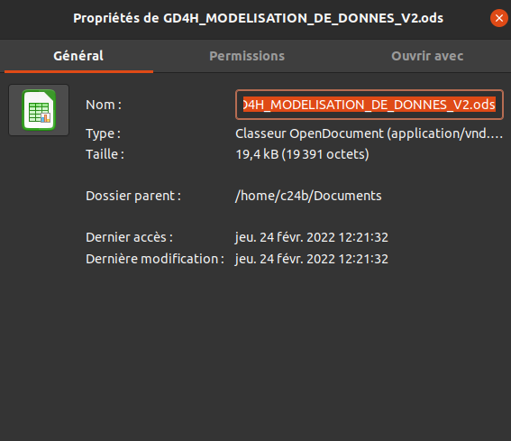
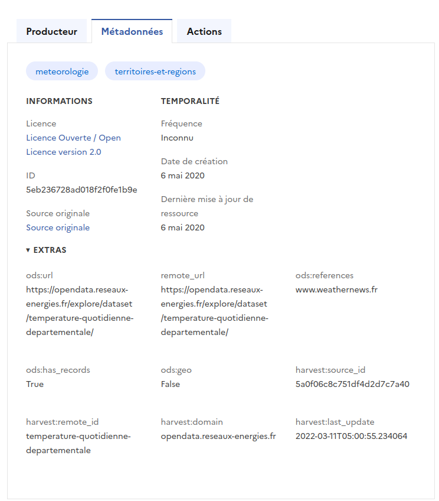

# La data dans tous ses états

La `fabrique des données`: de leur acquisition à leur usage

---

## Déroulé

----

#### Quelques définitions
------
  * donnée
  * jeu de données
  * type vs format
  * metadonnées

> Illustration

----

#### Processus:  de la donnée à l'information
-----
  * collecter
  * stocker
    * échanger
  * analyser
  * exploiter
  * visualiser 
  

---

## Définitions

----

### DATA

* ~ce qui est donné~ ce qui est collecté/capturé/reçu 
* unité minimale d'information figée, stockable et transmissible 
  

**Qualifier/Caractériser la donnée**

- dans un ensemble: *jeu de données*
- dans un contexte: *métadonnées*
- dans son mode de stockage et de transport: *format, source, type*

----

### DATASET

* ensemble de données 
* regroupées ou ordonnées 
* selon un contexte particulier, un objectif spécifique
* qui a une forme spécifique: *format, type, mode de stockage* 

----

### type vs format

`format` = mode de représentation et de stockage des données 

`type` = représentation informatique de la donnée

> Avertissement: la distinction est purement pédagogique

----

##### Format
  * format de représentation: *table, arbres, graphes, matrices, séries, ...* 
  * format de stockage: *csv,json, xml, ...* <small>(induit le format de représentation)</small>
   
---- 

###### Type
   * simple: entier, booléen, chaine de caractères, décimal, ...
   * types composés: liste, dictionnaire, set, matrices
   * types calculés: date, coordonnées, ...

----

### METADATA

**Méta**données:
* *données qui décrivent les données*
* informations contextuelles
* ~les données elles-même~
  
> Mode d'emploi, notice, informations contextuelles

**Exemples**: coordonnées GPS d'une photo, notice bibliographique de livre, champ d'un formulaire

---

#### Illustration

`data`, `dataset`, `metadata`, `type`, `format`

----

Prenons un exemple avec une série temporelle de relevé de température, un tableau à deux dimensions: une date et un degré

|Date     |   Degré (C°)|
|---------|-------------|
|01/01/2021| -3         |
|02/01/2021| -1         |
|03/01/2021|  1         |
| ....     | ...        |

----
##### Le tableau lui même

|         |             |
|---------|-------------|
|Valeur/ données| -3/01/01/2021         |
|Champ/ métadonnée| Degré/Date         |
|Jeu de données|  ensemble de 2 dimensions reliées|
|Type de données| série temporelle composée de date (str) & d'entier relatifs (int)|
|Format de données| table|

----

### Le fichier excel

* Représentation des données: tabulaire 
* format du fichier: excel
* date de création, identité de l'auteur, enventuellement droits associés 
* titre du fichier: sujet abordé

----

### Fiche explicative

* renseigne la source, la provenance, objectif, périmêtre, la license...
* le formalisme des métadonnées varie: du très libre au très contraint <small>(abordé dans data-management)</small>

---

## Processus

----

### Collecter, Acquerir

- Identifier la ressource 
- Requêter
- Parcourir
- Extraire
- Nettoyer, convertir, formater
- Stocker

>
----

### Stocker, Ranger, Classer

----

### Echanger, Transmettre

----

### Analyser, Etudier

----

### Exploiter, Calculer

----

### Représenter, Exposer, Voir 

----